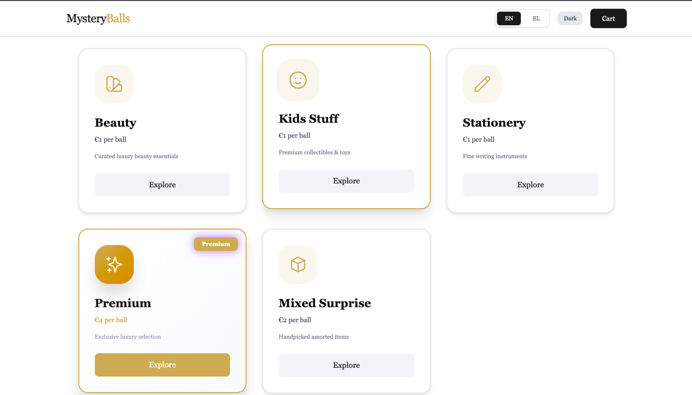
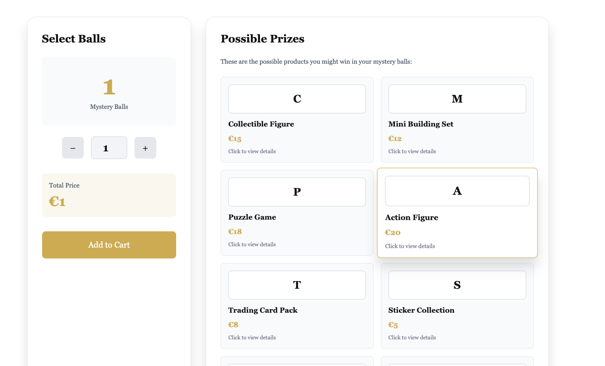
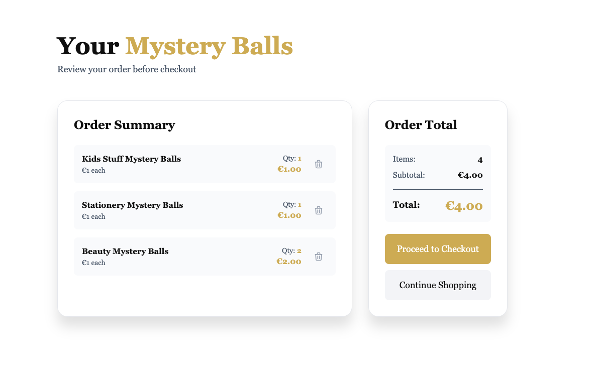
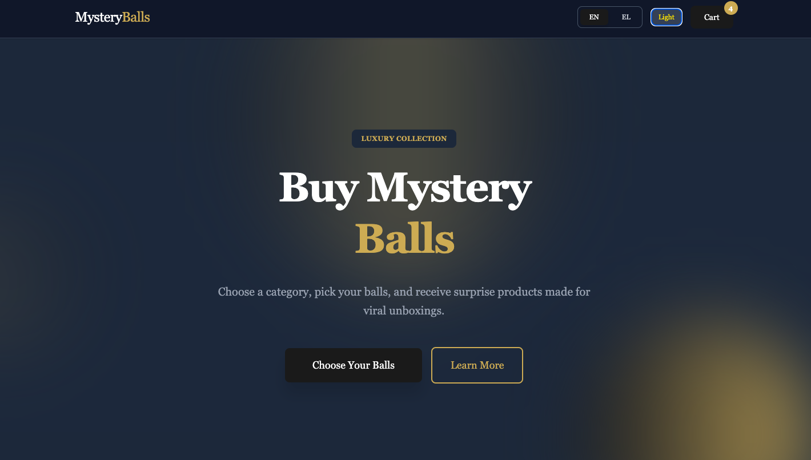

# Mystery Balls Shop

An e-commerce platform for mystery ball subscriptions with multi-language support, dark mode, and a unique blind-box purchasing system.

## Features

### Core Functionality
- **Mystery Ball System**: Customers purchase quantities of mystery balls instead of specific products
- **5 Product Categories**: Beauty, Kids Stuff, Stationery, Premium, and Mixed Surprises
- **Dynamic Pricing**: Different prices per category (€1-€4 per ball)
- **Shopping Cart**: Add/remove items with real-time total calculation

### Design & UX
- **Luxury Aesthetic**: Gold and black color scheme with Playfair Display serif font
- **Dark Mode**: Toggle between light and dark themes
- **Multi-language Support**: English and Greek (Ελληνικά)
- **Mobile Responsive**: Fully optimized for all devices
- **Smooth Animations**: 12+ custom animations

### Additional Features
- **Product Detail Modal**: Click any product to view detailed information
- **Success Animations**: Visual feedback when adding items to cart
- **Responsive Grid Layouts**: Adaptive design for all screen sizes
- **Professional SVG Icons**: Category icons for visual appeal

## 📸 Screenshots

### Homepage


### Categories Section


### Product Modal


### Shopping Cart


### Dark Mode



## Installation

1. **Clone the repository:**
```bash
git clone https://github.com/Alatsakimaria/mystery-balls-shop.git
cd mystery-balls-shop
```

2. **Install dependencies:**
```bash
npm install
```

3. **Start the development server:**
```bash
npm run dev
```

The app will open at `http://localhost:5173`


## Language Support

- **English (EN)** - Default language
- **Greek (EL)** - Ελληνικά

Switch languages via the navbar buttons. All UI elements are translated.


## How It Works

1. **Browse Categories**: View 5 different product categories on the homepage
2. **Select Quantity**: Choose how many mystery balls you want from each category
3. **View Possible Prizes**: See what products might be in your mystery balls
4. **Add to Cart**: Add selected balls to your shopping cart
5. **Review Order**: Check your cart and proceed to checkout
6. **Checkout**: Confirm your order (manager fulfillment coming soon)


## Future Features

- Admin/Manager Dashboard for order fulfillment
- Random product assignment system
- Order history tracking
- User authentication
- Payment integration
- Email notifications
- Product images
- Backend database integration

## Author

Created by [Maria Alatsaki](https://github.com/Alatsakimaria)

## Links

- **GitHub Repository**: [mystery-balls-shop](https://github.com/Alatsakimaria/mystery-balls-shop)
- **Live Demo**: Coming soon


